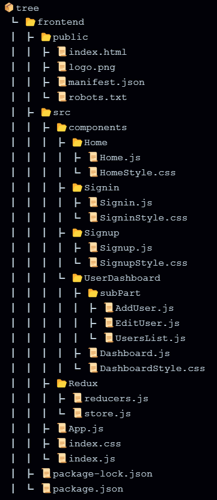
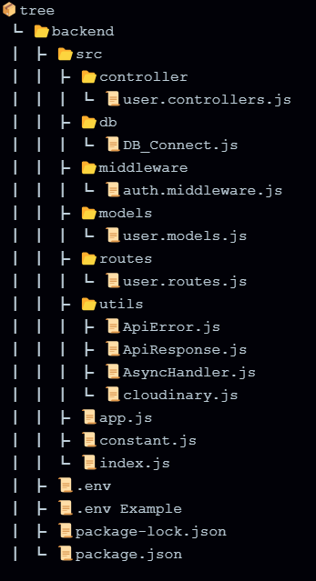

# Setup the Project to Run

## 1. Create a new project

create react app by [Create React App](https://github.com/facebook/create-react-app) command.

### a. Directory of frontned will like this
 

### b. Directory of backned will like this

## 2. Installation

Installation of neccessary packages for frontned and backned.

### install these in frontend directory

@reduxjs/toolkit : ^2.2.3  
axios : ^1.6.8  
dotenv : ^16.4.5  
react : ^18.2.0  
react-dom : ^18.2.0  
react-redux : ^9.1.0  
react-router : ^6.22.3  
react-router-dom : ^6.22.3  
react-scripts : ^5.0.1  

### install these in backend directory

bcrypt : ^5.1.1  
cloudinary : ^2.1.0  
cookie-parser : ^1.4.6  
cors : ^2.8.5  
dotenv : ^16.4.5  
express : ^4.19.2  
jsonwebtoken : ^9.0.2  
mongodb : ^6.5.0  
mongoose : ^8.2.4  
multer : ^1.4.5-lts.1  
nodemon : ^3.1.0

## 3. Create a new database project on MongoDB 

Create a new database project on MongoDB Atlas and connect to the backend by providing MongoDB URI in .env file.

## 4. fill all the fields in the .env file

Fill the MongoDB URI, access token secret, refresh token etc.

## 5. Run the command

Run the server by `npm start` in `Root_folder/backend` 
start the React script by `npm start` in `Root_folder/frontend` 

`Note:` Do this in there respective directory.

# The End